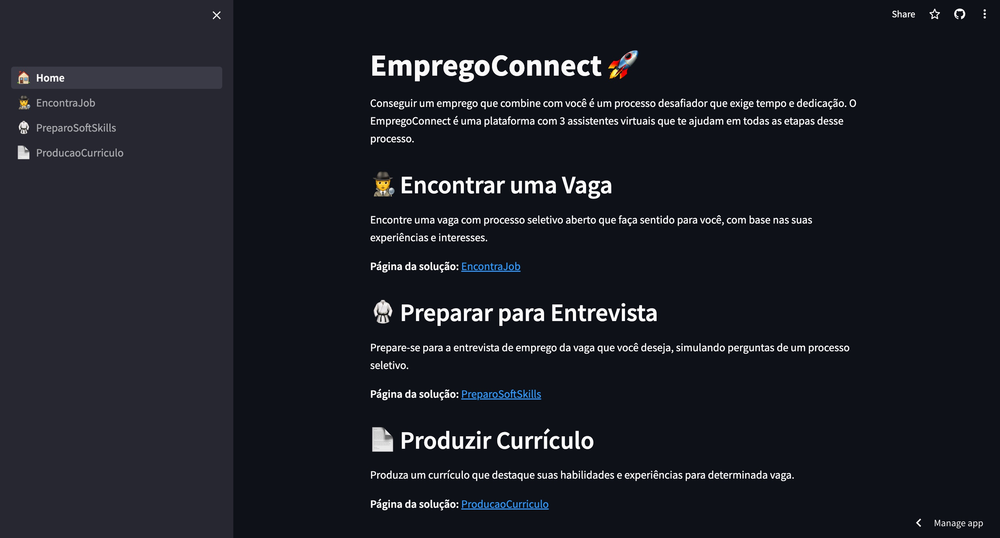
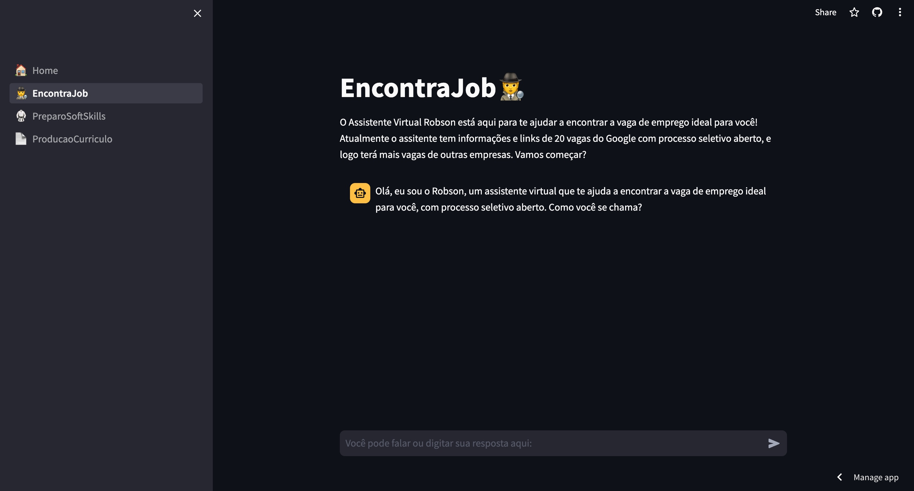
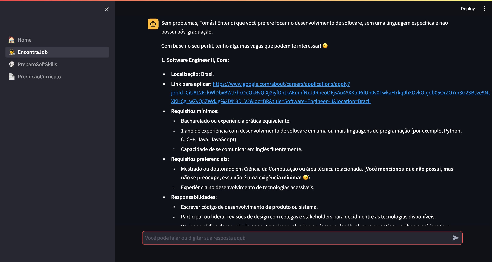
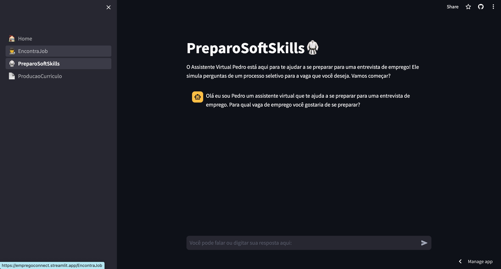
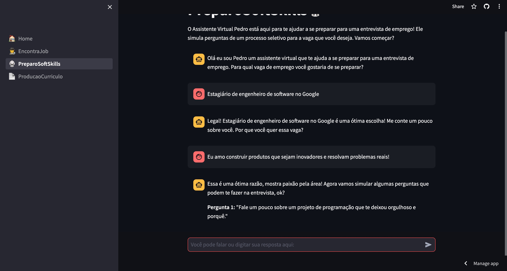
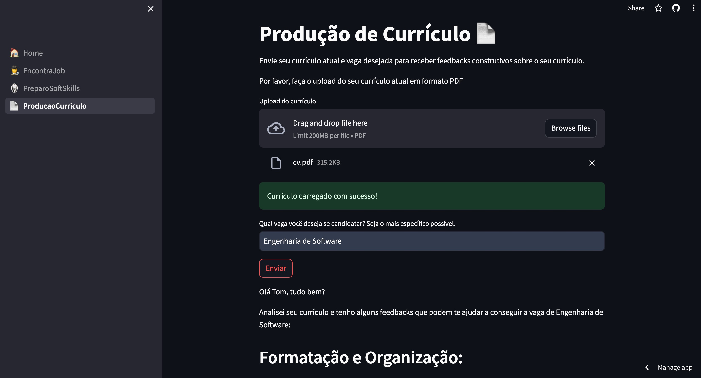
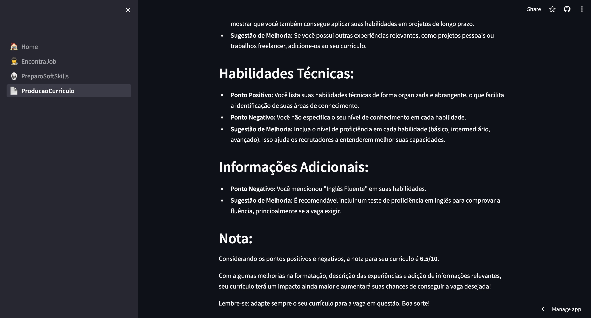

## EmpregoConnect 🚀

**O que é o EmpregoConnect?**

O EmpregoConnect é uma plataforma que te ajuda a encontrar emprego ideal!

**Contexto do problema 😢**

Encontrar um emprego pode ser um processo desafiador e demorado. 

1. Muitas vezes é difícil encontrar vagas com processo seletivo aberto que combinem com suas experiências e interesses.

2. Preparar-se para a entrevistas de emprego não é trivial. É importante saber como responder perguntas comuns e se preparar para possíveis perguntas inesperadas, mas onde conseguir simular uma entrevista?.

3. Seu currículo é a primeira impressão que você passa para o recrutador. É importante que ele esteja bem estruturado e adequado para a vaga que você está se candidatando, mas a maioria da pessoas acaba usando um mesmo currículo para vagas diferentes.

**Soluções 🚀**

Na plataforma EmpregoConnect você irá encontrar três assistentes virtuais, cada uma especializada em um dos problemas acima:

* **EncontraJob🕵️:** Encontra vagas de emprego com processo seletivo aberto que combinem com suas experiências e interesses, ele explica quais critérios você não se adequou da vaga e retorna um link para o processo seletivo.

* **PreparoSoftSkills🥋:** Simula uma entrevista de emprego para sua vaga de interesse, fornecendo feedback para você se preparar da melhor forma.

* **ProducaoCurriculo📄:** Analisa seu currículo e vaga de interesse, eno final fornece feedback construtivo para que você o aperfeiçoe e aumente suas chances de ser chamado para uma entrevista.

### Apresentação do projeto 

[](https://youtu.be/lf5KPec3JUs))


### EmpregoConnect está no ar!

Fiz o deploy por meio da Streamlit Cloud.
Para acessar o aplicativo EmpregoConnect, clique no link abaixo:

**Comece sua jornada em busca do emprego ideal agora mesmo!**

[](https://empregoconnect.streamlit.app/)


**Benefícios do EmpregoConnect:**

* **Eficiência:** Assistentes virtuais especialista te ajudam a encontrar vagas, se preparar para entrevistas e melhorar seu currículo de forma rápida e eficiente.
* **Personalização:** Feedback personalizado de acordo com suas necessidades e perfil.


**Arquivos do Projeto:**

* **🏠Home.py** Página Home explica sobre os assistentes
* **1_🕵️EncontraJob.py:** Código do assistente virtual EncontraJob.
* **2_🥋PreparoSoftSkills.py:** Código do assistente virtual PreparoSoftSkills.
* **3_📄ProducaoCurriculo.py:** Código do assistente virtual ProducaoCurriculo.

**Tecnologias utilizadas:**

* Python
* Streamlit
* Google Generative AI


## Imagens do aplicativo 

### Home


### Assistente EncontraJob

### Assistente EncontraJob em ação


### Assistente PreparoSoftSkills

### Assistente PreparoSoftSkills em ação


### Assistente ProducaoCurriculo

### Assistente ProducaoCurriculo em ação


**Como rodar o projeto na sua máquina:**

1. Clonar o repositório:
2. Acessar a pasta do projeto /streamlit
3. Instalar as dependências:
```bash
pip install -r requirements.txt
```
4. Criar um arquivo .env e adicionar a chave da API do Google Generative AI:
```bash
gemini_api_key = ""
```
4. Rodar o arquivo 🏠Home.py:
```bash
streamlit run 🏠Home.py
```


